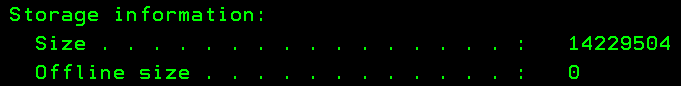
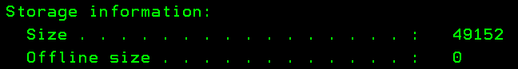
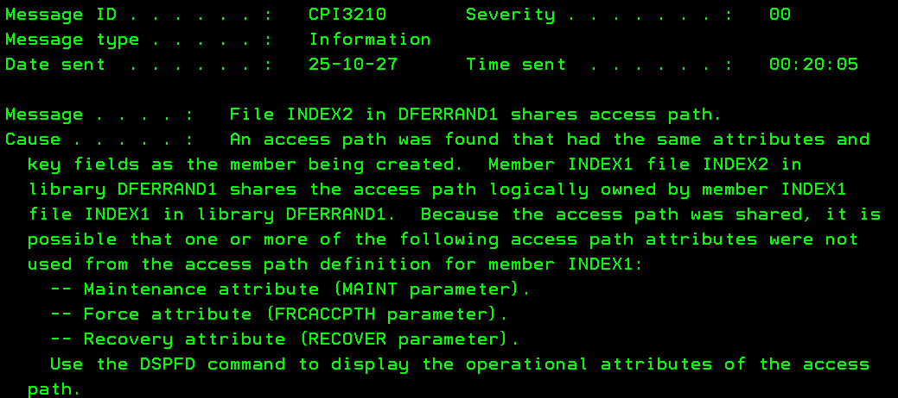
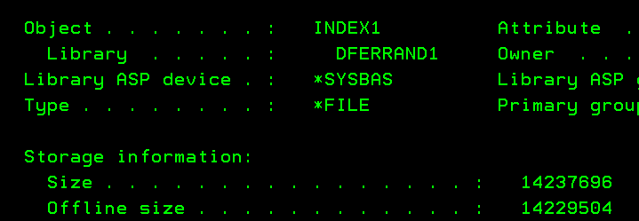
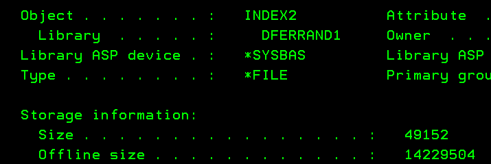
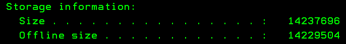

+++
title = "How big is my index?"
date = "2025-10-27T07:30:00-04:00"
#dateFormat = "2006-01-02" # This value can be configured for per-post date formatting
author = "Damien Ferrand"
cover = ""
tags = ["ibmi", "db2"]
keywords = ["ibmi", "db2"]
description = "Description of the different sizes of an index."
showFullContent = false
readingTime = true
hideComments = false
+++

While most objects on IBM i have a pretty well defined size, indices are a
different beast.

Let's consider a table TABLE1 containing 10k lines without any index, the table
is about 25MB. Let's now create an index called INDEX1. Let's now look at the
INDEX1 size with `DSPOBJD`: 

The actual size of the index is 14MB, the offline is 0 which is normal since the
index hasn't been saved yet.

If we duplicate INDEX1 to INDEX2 with `CRTDUPOBJ` and look at INDEX2 size with
`DSPOBJD`, we see its size is 49KB:

The reason for this difference can be found in the joblog after `CRTDUPOBJ`, the
`CPI3210` message: 

Since INDEX1 and INDEX2 are the same, the system duplicated the `*FILE` object
but did not duplicate the access path which is the actual B-tree of the index.
Both `*FILE` objects share the same access path. This has the following
advantages:

- The access path is, by far, the biggest part of an index object, having only
  one access path saves some disk space.
- The database only has to maintain one access path when a record is added,
  updated, or deleted in the underlying table, reducing the CPU and IO load.
- The query optimizer only considers the access paths reducing the CPU load even
  for SELECT operations.

If we save INDEX1 and INDEX2 and look at their size with `DSPOBJD`:

While the actual size hasn't changed for both indices (14MB and 49KB), the
offline size is now 14MB for both, that's because the offline size accounts for
all sections of the logical file whereas the size doesn't.

INDEX1 owns the access path, that's why it's reporting the full size. On the
other hand, INDEX2 uses the access path owned by INDEX1.

Using the `DSPFD` on the indices we can determine which one owns the access
path.

If we delete INDEX1 and check INDEX2 with `DSPOBJD`, we see its size was changed
to 14MB:

That's because the system transfered the ownership of the access path to INDEX2
when INDEX1 was deleted without having to rebuild it.

Of course, duplicating an index is generally not very useful, fortunately the
system in also able to share access path in other cases, for example, if you
create an index INDEX1 on fields FldA and FldB and then create an index INDEX2
on FldA only, the system will reuse INDEX1 access path for INDEX2. Note that if
you were to create INDEX2 before INDEX1, there would be no sharing of access
path.
